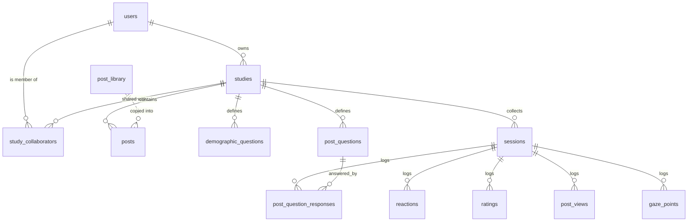

Misinfo Research stores everything in a single SQLite file, opened with [better-sqlite3](https://github.com/WiseLibs/better-sqlite3) in `db/database.js`. That one module owns the whole schema: it creates the tables, runs every migration, seeds defaults, and exports the open database handle. Every route file simply does `require('../db/database')` and gets the same connection.

This page is for developers reading or querying the database directly. If you only want your results as a spreadsheet, use the **Export** tab in the admin panel instead — it flattens all of this into sheets for you.

## The database file

```js
const dbPath = path.resolve(process.env.DATABASE_PATH || './data/research.db');
```

The directory is created on boot if it does not exist. Four pragmas are set on every connection:

| Pragma | Value | Why |
| --- | --- | --- |
| `journal_mode` | `WAL` | Readers (export, dashboard) never block the participant writes. |
| `foreign_keys` | `ON` | The `ON DELETE CASCADE` clauses below actually fire. |
| `busy_timeout` | `5000` | Wait up to 5 s on a write conflict instead of throwing. |
| `cache_size` | `-20000` | ~20 MB of page cache in memory. |

<Note>
  `foreign_keys = ON` is what makes deleting a study clean up its posts, sessions, reactions, ratings, questions and gaze points automatically. Do not turn it off in an external client if you intend to delete rows.
</Note>

## The `migrate()` pattern

The schema was not designed up front — it grew as the platform grew. Rather than a versioned migration runner, `db/database.js` uses a deliberately blunt helper:

```js
const migrate = (sql) => { try { db.exec(sql); } catch (_) {} };
migrate('ALTER TABLE studies ADD COLUMN hide_topic_badges BOOLEAN DEFAULT 0');
```

Every statement swallows its own error. `ALTER TABLE … ADD COLUMN` throws if the column already exists, so on the second and every subsequent boot the statement fails harmlessly and the schema is left alone. `CREATE TABLE IF NOT EXISTS` and `CREATE INDEX IF NOT EXISTS` are used the same way. The consequences worth knowing:

- **The file is the migration history.** Migrations run top to bottom on every boot, in source order. Adding a column means appending one more `migrate(...)` line at the end — never editing an earlier one, since existing databases already applied it.
- **Order matters for defaults, not for structure.** A column added by `ALTER TABLE … DEFAULT x` gives `x` to existing rows too, which is why almost every added flag defaults to the value that preserves the pre-migration behaviour.
- **Errors are invisible.** A genuinely malformed migration fails silently. If a column seems missing, check the statement rather than the logs.

Two data migrations sit outside the `migrate()` helper and are idempotent by their own query: the first-admin seed (runs only when the `users` table is empty), and the disk-image-to-BLOB migration (skips any post that already has a BLOB).

<Warning>
  An earlier version of the file contained a seed-refresh block that rewrote `source_name`, `headline_a/b` and `content_a/b` on every boot. It was idempotent only for untouched studies and silently destroyed researcher edits on every redeploy. It has been removed — the comment marking its absence is still in the source as a warning. Do not reintroduce boot-time `UPDATE`s over researcher-owned content.
</Warning>

## Entity overview



Two tables sit outside the ownership tree: `post_library` (a global, study-agnostic catalogue) and `locale_overrides` (platform-wide UI strings).

## `users`

Accounts for the admin panel only. Participants are never authenticated. Managed under the **Accounts** button in the panel header.

| Column | Type | Notes |
| --- | --- | --- |
| `id` | INTEGER | Primary key. |
| `username` | TEXT | `NOT NULL UNIQUE`. The login. |
| `email` | TEXT | Optional. |
| `password_hash` | TEXT | `NOT NULL`. bcrypt hash. |
| `role` | TEXT | `NOT NULL DEFAULT 'researcher'`. `'admin'` or `'researcher'`. |
| `is_active` | INTEGER | `NOT NULL DEFAULT 1`. `0` disables the account. |
| `created_at` | TEXT | `DEFAULT (datetime('now'))`. |
| `last_login` | TEXT | `NULL` until the first successful login. |

The first admin is seeded from the `ADMIN_PASSWORD` environment variable, but **only when the table is empty**. After that seed, login checks the hash in this table and changing the env var has no effect. If no users exist and `ADMIN_PASSWORD` is unset, the seed is skipped with a warning rather than an exit — so CLI scripts can require the module without a loaded `.env`.

## `study_collaborators`

Per-study sharing. A researcher listed here gets full edit access to that one study — not delete, not collaborator management, which stay owner-only.

| Column | Type | Notes |
| --- | --- | --- |
| `study_id` | INTEGER | `REFERENCES studies(id) ON DELETE CASCADE`. |
| `user_id` | INTEGER | `REFERENCES users(id) ON DELETE CASCADE`. |
| `added_at` | TEXT | `DEFAULT (datetime('now'))`. |

Primary key is the composite `(study_id, user_id)`. Index: `idx_collab_user` on `user_id`.

## `studies`

The largest table by far — a study row carries its identity, its design, and every screen of participant-facing copy. Child tables (`posts`, `sessions`, `demographic_questions`, `post_questions`) resolve ownership by joining up to `studies.owner_id`, so none of them carries an owner column.

### Identity and ownership

| Column | Type | Notes |
| --- | --- | --- |
| `id` | INTEGER | Primary key. |
| `name` | TEXT | `NOT NULL`. Internal name shown in the panel. |
| `slug` | TEXT | `NOT NULL UNIQUE`. Public URL is `/study/<slug>`. |
| `description` | TEXT | Internal note. |
| `participant_title` | TEXT | Title participants see; falls back to `name`. |
| `contact_email`, `institution` | TEXT | Shown on the consent screen. |
| `is_active` | BOOLEAN | `DEFAULT 1`. Inactive studies reject new sessions. |
| `created_at` | DATETIME | `DEFAULT CURRENT_TIMESTAMP`. |
| `owner_id` | INTEGER | `REFERENCES users(id)`. Nullable so the `ALTER` could not fail; backfilled by the admin seed. Index: `idx_studies_owner`. |
| `custom_domain` | TEXT | Exact hostname bound to this study. Requests to it serve only this study — no admin, no other studies. `NULL` = no binding. |

### Design and flow

| Column | Type | Notes |
| --- | --- | --- |
| `builder_mode` | INTEGER | `DEFAULT 0`. `1` = the study is driven by `parts_json` (the **Configurator** tab); `0` = the legacy fixed feed → rating flow. |
| `parts_json` | TEXT | The part sequence. See [JSON columns](#json-columns). |
| `logic_json` | TEXT | Conditional-logic rules. See [JSON columns](#json-columns). |
| `layout_type` | TEXT | `DEFAULT 'feed'`. Legacy study-level layout. |
| `posts_per_session` | INTEGER | `DEFAULT 10`. Legacy flow: how many active posts are sampled. |
| `post_questions_display_mode` | TEXT | `DEFAULT 'after_interaction'`. Study-level default; parts override it. |
| `demographics_position` | TEXT | `DEFAULT 'after_consent'`. Also `'before_debrief'` or `'hidden'`. Takes precedence over `show_demographics`. |

### Manipulation and conditions

| Column | Type | Notes |
| --- | --- | --- |
| `manipulation_json` | TEXT | `DEFAULT '[]'`. The between-subjects content manipulation. See [JSON columns](#json-columns). |
| `manipulation_field` | TEXT | `DEFAULT 'headline'`. One of `headline`, `content`, `image`, `mixed`. |
| `manipulation_variants` | INTEGER | `DEFAULT 2`. |
| `metric_conditions_json` | TEXT | Social-proof (metrics) conditions. Backfilled at boot from the legacy columns below for any study where it is `NULL`. |
| `condition_queue_json` | TEXT | The permuted-block randomisation queue, consumed one entry per session. |
| `show_metrics` | INTEGER | `DEFAULT 1`. |
| `allow_multi_reactions` | INTEGER | `DEFAULT 0`. `1` lets a participant stack non-opposing reactions; like/dislike stay mutually exclusive regardless. |
| `high_metrics_min`, `high_metrics_max` | INTEGER | `800` / `1300`. Legacy source for the `HIGH` arm. |
| `low_metrics_min`, `low_metrics_max` | INTEGER | `1` / `20`. Legacy source for the `LOW` arm. |
| `enable_condition_a`, `enable_condition_b` | BOOLEAN | `DEFAULT 1`. Legacy style arms. |
| `enable_metrics_high`, `enable_metrics_low` | BOOLEAN | `DEFAULT 1`. Legacy metric arms; read into `metric_conditions_json` on backfill. |

### Participant-facing copy

| Column | Type | Notes |
| --- | --- | --- |
| `consent_text`, `no_consent_text` | TEXT | Consent screen, and the screen shown after a refusal. |
| `instruction_text` | TEXT | |
| `transition_feed_text`, `transition_rating_text` | TEXT | Legacy flow transitions. |
| `debrief_text` | TEXT | |
| `demographics_title`, `demographics_subtitle` | TEXT | Per-study overrides of the demographics screen header. `NULL`/empty = use the locale default. |
| `label_action_like`, `label_action_dislike`, `label_action_share`, `label_action_flag` | TEXT | Reaction button labels. |
| `label_likert_question`, `label_likert_min`, `label_likert_max` | TEXT | Rating scale copy. |
| `comment_placeholder` | TEXT | |
| `label_style_a`, `label_style_b` | TEXT | Condition labels used in the panel. |

<Note>
  Each `label_*` column and `comment_placeholder` was created by an `ALTER TABLE … DEFAULT '<Polish string>'`, so every study is born carrying that literal text. Because the participant frontend resolves `study.x || t('actions.x')`, the column always wins over the locale file. `db.STUDY_LABEL_DEFAULTS` — derived at boot from `public/locales/pl.json` via the `FIELD_TO_LOCALE_KEY` map — lets the code detect "the researcher never customised this" without hardcoding Polish in render code.
</Note>

### Visibility toggles

All default to `1`, so studies created before each toggle existed keep their old behaviour.

| Column | Notes |
| --- | --- |
| `show_instructions` | The instruction screen. |
| `show_instruction_actions` | The reaction-preview box on the instruction screen. |
| `show_transition_feed`, `show_transition_rating` | Legacy transition screens. |
| `show_debrief` | The debrief screen. |
| `show_debrief_posts` | The "posts — true and false" list inside the debrief. |
| `show_demographics` | The whole demographics screen. `0` → sessions get `NULL` demographic fields. |
| `show_reactions` | Reaction buttons. |
| `show_avatars` | Post avatars (per-post `posts.show_avatar` overrides). |
| `hide_topic_badges` | `DEFAULT 0`. |
| `enable_comments` | `DEFAULT 0`. Study-level gate for the comment field. |

### Language

| Column | Type | Notes |
| --- | --- | --- |
| `language` | TEXT | `DEFAULT 'pl'`. The study's own language. |
| `translations_json` | TEXT | `DEFAULT '{}'`. Overlay of translated study content. See [JSON columns](#json-columns). |

<Info>
  This is study **content** — the words participants read. It is unrelated to the admin panel UI language (Polish by default, English via the switch in the header), which is served from `public/locales/admin/*.json` and, at runtime, `locale_overrides`.
</Info>

### Panel recruitment

| Column | Type | Notes |
| --- | --- | --- |
| `external_id_param_name` | TEXT | `DEFAULT 'res_id'`. Name of the URL query parameter captured into `sessions.external_id`. |
| `completion_redirect_url` | TEXT | Where the participant goes after the debrief. Supports `{ext_id}` and `{session_id}` placeholders. `NULL` = no redirect. |
| `completion_redirect_delay_seconds` | INTEGER | `DEFAULT 4`. |
| `completion_redirect_notice` | TEXT | Sticky notice on the debrief. `NULL` = no sticky box. |
| `decline_redirect_url` | TEXT | Screen-out endlink for participants who refuse consent. |
| `decline_redirect_delay_seconds` | INTEGER | `DEFAULT 4`. |
| `decline_redirect_notice` | TEXT | |
| `decline_redirect_immediate` | INTEGER | `DEFAULT 0`. `1` skips the local decline screen entirely. Honoured only when `decline_redirect_url` is set. |

### Panel state

These store researcher view state, never participant data.

| Column | Default | Notes |
| --- | --- | --- |
| `export_config_json` | `'{}'` | Working column order/visibility/headers per **Export** sheet. |
| `export_profiles_json` | `'{}'` | Named export profiles. |
| `dashboard_config_json` | `'{}'` | **Dashboard** widget arrangement. Empty → smart defaults on first load. |
| `dashboard_profiles_json` | `'{}'` | Named dashboard profiles. |
| `analyses_json` | `'[]'` | Saved **Analyses** entries: `{ id, name, test, params, created_at }`. Results are recomputed on every load, never cached. |

### Tracking

| Column | Type | Notes |
| --- | --- | --- |
| `clarity_enabled` | INTEGER | `DEFAULT 0`. |
| `clarity_project_id` | TEXT | |
| `eyetracking_enabled` | INTEGER | `DEFAULT 0`. Gates the webcam gaze pipeline that writes `gaze_points`. |

## `posts`

Study content. `FOREIGN KEY (study_id) REFERENCES studies(id) ON DELETE CASCADE`.

| Column | Type | Notes |
| --- | --- | --- |
| `id` | INTEGER | Primary key. |
| `study_id` | INTEGER | `NOT NULL`. |
| `order_index` | INTEGER | `NOT NULL DEFAULT 0`. |
| `is_active` | BOOLEAN | `DEFAULT 1`. |
| `topic` | TEXT | |
| `hide_topic` | INTEGER | `DEFAULT 0`. Per-post topic-badge suppression. |
| `emoji` | TEXT | |
| `source_name`, `source_handle`, `time_ago` | TEXT | The fake account header. |
| `headline_a`, `content_a` | TEXT | Arm **A** content. |
| `headline_b`, `content_b` | TEXT | Arm **B** content. |
| `is_true` | BOOLEAN | `DEFAULT 0`. Ground truth of the claim. |
| `manipulation_techniques` | TEXT | `DEFAULT '[]'`. JSON array of technique labels, e.g. `["urgency","conspiracy"]`. |
| `part_id` | TEXT | The part this post belongs to. Kept in sync with the first element of `part_ids_json`. |
| `part_ids_json` | TEXT | Canonical list of parts the post appears in. `NULL` → runtime falls back to `[part_id]`, so pre-migration posts behave identically. |
| `base_likes`, `base_shares`, `base_dislikes`, `base_flags` | INTEGER | `DEFAULT 0`. Fallback metric values. |
| `metrics_override_json` | TEXT | Per-condition pinned metrics. |
| `post_comment`, `post_comment_author` | TEXT | Legacy single canned comment. |
| `post_comments_json` | TEXT | Legacy multi-comment payload. |
| `builder_comments_json` | TEXT | `DEFAULT '[]'`. Canned comments for builder studies. |
| `updated_at` | DATETIME | `DEFAULT NULL`. |
| `library_post_id` | INTEGER | Audit pointer to the `post_library` row this post was copied from. **No foreign key** — deleting a library entry must not cascade into live study posts. |

### Per-post toggles

All default to `1`.

| Column | Notes |
| --- | --- |
| `show_avatar` | Overrides `studies.show_avatars`. |
| `show_like`, `show_dislike`, `show_share`, `show_flag` | A button renders iff `studies.show_reactions != 0` **and** the part's `show_reactions !== false` **and** the post's `show_<action> != 0`. |
| `show_comment` | The comment field shows iff `studies.enable_comments` **and** `posts.show_comment != 0`. |

### Images

Images live in the database as BLOBs, not on disk — Railway's filesystem is ephemeral, so a BLOB alongside the owning row survives every deploy the database survives.

| Column | Type | Notes |
| --- | --- | --- |
| `image_blob_a` / `image_mime_a` | BLOB / TEXT | Arm A image. |
| `image_blob_b` / `image_mime_b` | BLOB / TEXT | Arm B image. |
| `avatar_blob` / `avatar_mime` | BLOB / TEXT | Source avatar. |
| `image_path`, `image_path_a`, `image_path_b`, `avatar_path` | TEXT | Legacy filenames, kept for the boot migration. |

A boot-time function walks `UPLOADS_PATH` (default `./uploads`), reads `<uploads>/<study_id>/<filename>` for any post whose path column is set but whose BLOB is still `NULL`, and loads the bytes in. Posts that already have a BLOB are skipped, so the pass is safe on every boot.

## `post_library`

A global, study-agnostic catalogue of reusable posts. Copy one into a study with `POST /studies/:studyId/posts/from-library`; the copy is **fully independent** — later edits on either side never propagate.

| Column | Type | Notes |
| --- | --- | --- |
| `id` | INTEGER | Primary key. |
| `name` | TEXT | `NOT NULL`. Catalogue name. |
| `category`, `description` | TEXT | |
| `translations_json` | TEXT | `DEFAULT '{}'`. |
| `is_active` | INTEGER | `DEFAULT 1`. |
| `created_at`, `updated_at` | DATETIME | `DEFAULT CURRENT_TIMESTAMP`. |

Beyond those, the table repeats every content column of `posts` — but **not** `study_id`, `order_index` or `part_id`, which are study placement rather than content. The shared list lives in one constant, `POST_LIBRARY_CONTENT_COLS` (exported as `db.POST_LIBRARY_CONTENT_COLS`), used by the table definition, the copy-into-study `INSERT … SELECT`, and the CRUD endpoints — so the three can never drift apart.

## `demographic_questions`

Per-study demographic questions. `REFERENCES studies(id) ON DELETE CASCADE`. Edited under the **Demographics** tab.

| Column | Type | Notes |
| --- | --- | --- |
| `id` | INTEGER | Primary key. |
| `study_id` | INTEGER | `NOT NULL`. |
| `field_key` | TEXT | `NOT NULL`. The four seeded keys — `age`, `residence`, `education`, `gender` — map onto dedicated `sessions` columns; anything else lands in `sessions.demographics_extra_json`. |
| `label` | TEXT | `NOT NULL`. |
| `input_type` | TEXT | `DEFAULT 'radio'`. Also `multiselect`, `text`, `number`. |
| `options` | TEXT | `DEFAULT '[]'`. JSON array of `{ value, label }`. |
| `required` | INTEGER | `DEFAULT 1`. |
| `order_index` | INTEGER | `DEFAULT 0`. |
| `is_active` | INTEGER | `DEFAULT 1`. |
| `min_value`, `max_value` | REAL | `NULL` = no constraint. For `text`: min/max character count. For `number`: min/max numeric value. |

<Info>
  Demographic questions and their options are **study content stored in the database** — the words a participant reads. They stay in the study's own language and are never touched by the admin panel's UI translation. Switching the panel to English translates the tab and its buttons, not your questions.
</Info>

New studies are seeded with four Polish radio questions (`seedDefaultDemographicQuestions`, exported as `db.seedDefaultDemographicQuestions`), and the seed is skipped if the study already has any question rows.

`db.CODES` exports a numeric coding map for the four seeded fields' canonical Polish values — for example `gender: { 'kobieta': 1, 'mężczyzna': 2, 'inne': 3, 'wolę nie podawać': 4 }`.

## `post_questions`

Questions attached to posts or parts in builder studies. `REFERENCES studies(id) ON DELETE CASCADE`.

| Column | Type | Notes |
| --- | --- | --- |
| `id` | INTEGER | Primary key. |
| `study_id` | INTEGER | `NOT NULL`. |
| `label` | TEXT | `NOT NULL DEFAULT ''`. |
| `question_type` | TEXT | `NOT NULL DEFAULT 'open'`. Also `single`, `multi`, `likert`. |
| `options_json` | TEXT | `DEFAULT '[]'`. For `single`/`multi`: `{ value, label }` entries. For `likert`: an object with `scale`, `label_min`, `label_max`, `description`. |
| `required` | INTEGER | `DEFAULT 1`. |
| `order_index` | INTEGER | `DEFAULT 0`. |
| `is_active` | INTEGER | `DEFAULT 1`. |
| `part_id` | TEXT | Which part the question belongs to. |

## `sessions`

One row per participant run. `FOREIGN KEY (study_id) REFERENCES studies(id) ON DELETE CASCADE`.

| Column | Type | Notes |
| --- | --- | --- |
| `id` | INTEGER | Primary key. |
| `study_id` | INTEGER | `NOT NULL`. |
| `session_token` | TEXT | `NOT NULL UNIQUE`. The participant's only credential — every participant endpoint identifies the respondent by this value. |
| `is_preview` | INTEGER | `DEFAULT 0`. `1` = a researcher preview run; excluded from production counts. |
| `external_id` | TEXT | The panel respondent ID captured at session start, trimmed and capped at 256 characters. Frozen on the row — later study-config edits never rewrite it. |
| `style_condition` | TEXT | Assigned content arm (`A`/`B`, or the builder condition key). |
| `metric_condition` | TEXT | Assigned social-proof arm. `'BUILDER'` when metrics are not a real factor (0–1 enabled arms). |
| `full_condition` | TEXT | `"<style>-<metric>"`, or just the style key when `metric_condition = 'BUILDER'`. |
| `age`, `residence`, `education`, `gender` | TEXT | The four seeded demographics, written verbatim. |
| `demographics_extra_json` | TEXT | `DEFAULT '{}'`. Every non-seeded demographic answer, keyed by `field_key`. |
| `consented` | BOOLEAN | `DEFAULT 0`. |
| `completed` | BOOLEAN | `DEFAULT 0`. |
| `started_at` | DATETIME | `DEFAULT CURRENT_TIMESTAMP`. |
| `completed_at` | DATETIME | `NULL` until finished. |
| `feed_snapshot` | TEXT | JSON record of what this participant was actually shown. |
| `logic_skipped_parts_json` | TEXT | Part ids a logic rule skipped for this session — lets the export tell "skipped by rule" apart from "never reached". |
| `logic_end_rule_id` | TEXT | Id of the rule that ended the study early, if any. |
| `eyetracking_consent` | INTEGER | `NULL` = never asked. |
| `calibration_error` | REAL | |
| `n_recalibrations` | INTEGER | `DEFAULT 0`. |

## `reactions`

Append-only log of reaction clicks. `FOREIGN KEY (session_id) REFERENCES sessions(id) ON DELETE CASCADE`.

| Column | Type | Notes |
| --- | --- | --- |
| `id` | INTEGER | Primary key. |
| `session_id` | INTEGER | `NOT NULL`. |
| `post_id` | INTEGER | `NOT NULL`. No FK — the log survives post deletion. |
| `post_order` | INTEGER | The position at which this participant saw the post. |
| `action` | TEXT | `like`, `dislike`, `share`, `flag`, or `comment`. |
| `is_undo` | INTEGER | `DEFAULT 0`. `1` records a toggle-off click, so "they un-liked it at time T" is preserved rather than dropped. Every pre-migration row reads as a positive reaction. |
| `comment` | TEXT | Feed-mode comment text, carried on the same row as its action so the export needs no join. |
| `timestamp` | DATETIME | `DEFAULT CURRENT_TIMESTAMP`. |
| `dwell_ms` | INTEGER | `DEFAULT 0`. |
| `likes_shown`, `shares_shown`, `dislikes_shown`, `flags_shown` | INTEGER | `DEFAULT 0`. The metric numbers **actually displayed** to this participant on this post. |

<Tip>
  The `*_shown` columns are the reason social-proof effects are analysable at all. Metrics can be randomised per session from a range, so the numbers on screen exist nowhere else — recording them at click time is what makes them recoverable.
</Tip>

## `ratings`

| Column | Type | Notes |
| --- | --- | --- |
| `id` | INTEGER | Primary key. |
| `session_id` | INTEGER | `NOT NULL`, `ON DELETE CASCADE`. |
| `post_id` | INTEGER | `NOT NULL`. |
| `post_order` | INTEGER | |
| `belief_1_7` | INTEGER | The credibility rating, 1–7. |
| `comment` | TEXT | |
| `timestamp` | DATETIME | `DEFAULT CURRENT_TIMESTAMP`. |

## `post_views`

Dwell time for posts the participant looked at but never reacted to. Without it, a participant who scrolled past three posts and liked the fourth would leave no viewing data on the first three.

| Column | Type | Notes |
| --- | --- | --- |
| `session_id` | INTEGER | `NOT NULL`, `ON DELETE CASCADE`. |
| `post_id` | INTEGER | `NOT NULL`. |
| `post_order` | INTEGER | |
| `dwell_ms` | INTEGER | `DEFAULT 0`. **Accumulated**, not overwritten. |
| `first_seen_at`, `last_seen_at` | DATETIME | `DEFAULT CURRENT_TIMESTAMP`. Bracket the total viewing window. |

The composite primary key `(session_id, post_id)` lets the client upsert the same row when a participant returns to a post (`allow_back`), accumulating dwell. The export prefers `reactions.dwell_ms` when present and falls back to `post_views.dwell_ms`.

## `post_question_responses`

| Column | Type | Notes |
| --- | --- | --- |
| `id` | INTEGER | Primary key. |
| `session_id` | INTEGER | `NOT NULL`, `REFERENCES sessions(id) ON DELETE CASCADE`. |
| `post_id` | INTEGER | `NOT NULL`. **Sentinel `0`** for part-scoped rows — see below. |
| `post_order` | INTEGER | |
| `question_id` | INTEGER | `NOT NULL`, `REFERENCES post_questions(id) ON DELETE CASCADE`. |
| `part_id` | TEXT | Non-`NULL` only for part-scoped answers. |
| `response_text` | TEXT | Open answers. |
| `response_values_json` | TEXT | `DEFAULT '[]'`. Choice answers. |
| `created_at` | DATETIME | `DEFAULT CURRENT_TIMESTAMP`. |

Index: `idx_pqr_session` on `session_id`.

<Warning>
  When a part uses `pq_display_mode = 'after_all_posts'`, one question screen appears after the last post of the part rather than per post — so the answer has no post to anchor to. SQLite cannot make an existing `NOT NULL` column nullable without recreating the table, so those rows store `post_id = 0` and put the real anchor in `part_id`. **Detect part-scoped rows with `part_id IS NOT NULL`**, which is more reliable than `post_id = 0`.
</Warning>

## `gaze_points`

Raw webcam gaze samples, written only when `studies.eyetracking_enabled = 1` and the participant consented. High volume — one row per sample.

| Column | Type | Notes |
| --- | --- | --- |
| `id` | INTEGER | Primary key. |
| `session_id` | INTEGER | `NOT NULL`, `ON DELETE CASCADE`. |
| `post_id`, `post_order` | INTEGER | Nullable — a sample can fall outside any post. |
| `screen_name` | TEXT | Which participant screen was showing. |
| `t` | INTEGER | `NOT NULL`. Sample timestamp. |
| `x`, `y` | REAL | `NOT NULL`. Viewport coordinates. |
| `vw`, `vh` | INTEGER | Viewport size — needed to normalise `x`/`y` across devices. |
| `scroll_y` | INTEGER | Scroll offset, so a viewport point can be mapped back to document position. |
| `aoi` | TEXT | Area of interest resolved client-side at sample time, e.g. `headline`, `content`. |

Indexes: `idx_gaze_session` on `session_id`, `idx_gaze_post` on `(session_id, post_id)`.

## `locale_overrides`

Platform-wide UI string overrides, stored in the database so admin edits survive redeploys — editing the JSON locale files works in-container, but Railway wipes those edits on every deploy.

| Column | Type | Notes |
| --- | --- | --- |
| `lang` | TEXT | `NOT NULL`. |
| `key` | TEXT | `NOT NULL`. Dot-path, e.g. `actions.like`. |
| `value` | TEXT | The override. |
| `updated_at` | DATETIME | `DEFAULT CURRENT_TIMESTAMP`. |

Primary key is `(lang, key)`. The JSON files under `public/locales/` are the baseline; rows here override per key. A row is deleted rather than set to `NULL` when the admin reverts to the file default, so the table only ever carries real overrides.

`db.loadLocaleWithOverrides(lang)` reads `public/locales/<lang>.json`, flattens it to dot-paths, applies the override rows, and unflattens the result into the nested object the frontend `t()` helper expects. `db.flattenLocaleObj` and `db.unflattenLocale` are exported for the same conversion elsewhere.

## JSON columns

SQLite has no JSON type here — these are `TEXT` columns holding serialised JSON, and every read is wrapped in a `try/catch` with a fallback. Query them with SQLite's JSON1 functions or parse them in application code.

<AccordionGroup>
  <Accordion title="studies.parts_json — the part sequence">
    An array of part objects. `id` values are strings like `"part-0"` and are preserved verbatim, which is why translations and `posts.part_id` can match on them without any remapping.

    ```json
    [
      {
        "id": "part-0",
        "label": "Feed",
        "layout": "feed",
        "show_transition": false,
        "transition_text": "",
        "transition_emoji": "📱",
        "pq_display_mode": "after_interaction",
        "pq_title": "",
        "pq_subtitle": "",
        "require_interaction": false,
        "allow_back": true,
        "show_reactions": true,
        "max_seconds": 0,
        "requirements": []
      }
    ]
    ```

    `pq_display_mode` is one of `after_interaction`, `after_interaction_modal`, `with_post`, `after_post`, `after_all_posts`. `max_seconds` is clamped to 0–3600; `0` (or missing) means no limit. `transition_emoji` is meaningfully three-state: `undefined` = never touched, `""` = explicitly cleared so nothing renders, any string = use that emoji.
  </Accordion>

  <Accordion title="studies.manipulation_json — the content manipulation">
    Normalised on save to **at most one** manipulation with **exactly two** arms:

    ```json
    [
      {
        "id": "m1",
        "field": "headline",
        "conditions": [
          { "key": "A", "label": "Manipulative" },
          { "key": "B", "label": "Neutral" }
        ]
      }
    ]
    ```

    `field` is one of `headline`, `content`, `image`, `mixed` (anything else is coerced to `headline`). Arm keys are forced to `A` and `B` by position.

    <Warning>
      This cap is methodological, not cosmetic. Posts only store `_a`/`_b` content, so a third arm would be recorded on the session while silently rendering variant A content — a broken study that looks fine. The save handler drops extra manipulations and conditions beyond the first two, and the participant runtime slices the arm list to 2 as a second safety net.
    </Warning>
  </Accordion>

  <Accordion title="studies.metric_conditions_json — social-proof arms">
    ```json
    [
      { "key": "HIGH", "label": "Metryki HIGH", "min": 800, "max": 1300, "enabled": true },
      { "key": "LOW",  "label": "Metryki LOW",  "min": 1,   "max": 20,   "enabled": true }
    ]
    ```

    Backfilled at boot from `high_metrics_*`, `low_metrics_*` and `enable_metrics_*` for any study where the column is still `NULL`. At runtime only arms with `enabled !== false` and a `key` are assignable. Metric resolution order per post is: `posts.metrics_override_json[<condition key>]` → a random value in `[min, max]` when `max > 0` → the post's `base_*` value.
  </Accordion>

  <Accordion title="studies.logic_json — conditional logic">
    ```json
    {
      "version": 1,
      "rules": [
        {
          "id": "r1",
          "label": "Skip part 2 for under-26s",
          "enabled": true,
          "priority": 1,
          "timing": "after_demographics",
          "when":   { "source": "demographic", "key": "age", "op": "eq", "value": "18-25" },
          "action": { "type": "skip_part", "target_part_id": "part-1" }
        }
      ]
    }
    ```

    The engine in `lib/logic.js` is pure and dual-mode — `require`d on the server to validate rules on save, and loaded as `window.MisinfoLogic` in the participant runtime to evaluate them. Vocabulary: `source` ∈ `demographic`, `condition`, `post_question`, `reaction`; `op` ∈ `eq`, `ne`, `lt`, `le`, `gt`, `ge`, `contains`, `empty`, `not_empty`; `timing` ∈ `after_demographics`, `after_part`, `after_interaction`; `action.type` ∈ `skip_part`, `end_study`, `goto_part`, `hide_question`.

    Rules are validated before persisting — dangling part/question references, duplicate ids and malformed rules are rejected. Rules never fire in preview sessions.
  </Accordion>

  <Accordion title="studies.translations_json — study content overlay">
    Keyed by language code, each holding an overlay of translated study content:

    ```json
    {
      "en": {
        "consent_text": "…",
        "debrief_text": "…",
        "parts": [{ "id": "part-0", "label": "Feed", "transition_text": "…" }],
        "posts": [{ "id": 12, "headline_a": "…", "content_a": "…" }],
        "demographic_questions": [{ "id": 3, "label": "…", "options": [] }],
        "post_questions": [{ "id": 7, "label": "…" }]
      }
    }
    ```

    The overlay is applied when `studies.language !== 'pl'` — the row's own columns are the source, the overlay wins on read for both participants and the admin panel (so the researcher edits what the participant sees). Overlay entries match by `id`: numeric row ids for posts and questions, string part ids for parts. Because ids are the join key, duplicating a study remaps the numeric ids inside `translations_json` and drops entries whose source row no longer exists. A cleared `""` in the overlay deliberately beats the source value; only `null`/absent falls through.
  </Accordion>

  <Accordion title="Other JSON columns">
    | Column | Shape |
    | --- | --- |
    | `studies.condition_queue_json` | `[{ "style": "A", "metricKey": "HIGH" }, …]` — the permuted block queue. Entries are re-validated against the currently enabled conditions on every read, so editing the design cannot leave stale arms in the queue. Block size is `max(4, number of full conditions)`; the queue refills when empty. |
    | `posts.metrics_override_json` | `{ "<condition key>": { "likes": 0, "shares": 0, "dislikes": 0, "flags": 0 } }` — a pinned value always beats the condition range. |
    | `posts.manipulation_techniques` | `["urgency", "conspiracy", …]` — a flat array of labels. |
    | `posts.part_ids_json` | `["part-0", "part-2"]` — the parts a post appears in. |
    | `sessions.demographics_extra_json` | `{ "<field_key>": <answer> }` for every non-seeded demographic question. |
    | `sessions.logic_skipped_parts_json` | `["part-1", …]`. |
    | `post_questions.options_json` | Choice: `[{ "value": "…", "label": "…" }]`. Likert: an object with `scale`, `label_min`, `label_max`, `description`. |
    | `demographic_questions.options` | `[{ "value": "…", "label": "…" }]`. Note the column is named `options`, not `options_json`. |
  </Accordion>
</AccordionGroup>

## What the module exports

`db/database.js` exports the better-sqlite3 handle with helpers hung off it:

| Export | What it is |
| --- | --- |
| `db.seedDefaultPosts(studyId)` | Inserts the ten default posts. |
| `db.seedDefaultDemographicQuestions(studyId)` | Inserts the four default questions; no-op if any exist. |
| `db.DEFAULT_CONSENT_TEXT`, `db.DEFAULT_INSTRUCTION_TEXT`, `db.DEFAULT_DEBRIEF_TEXT` | Fallback copy when the study column is empty. |
| `db.DEFAULT_TRANSITION_FEED_TEXT`, `db.DEFAULT_TRANSITION_RATING_TEXT` | Same, for the legacy transition screens. |
| `db.CODES` | Numeric coding map for the four seeded demographics. |
| `db.POST_LIBRARY_CONTENT_COLS` | The content columns a library entry carries. |
| `db.loadLocaleWithOverrides(lang)`, `db.flattenLocaleObj`, `db.unflattenLocale` | Locale loading with the DB overlay. |
| `db.FIELD_TO_LOCALE_KEY`, `db.STUDY_LABEL_DEFAULTS` | DB column ↔ locale key map, and the PL baseline defaults derived from it at boot. |
